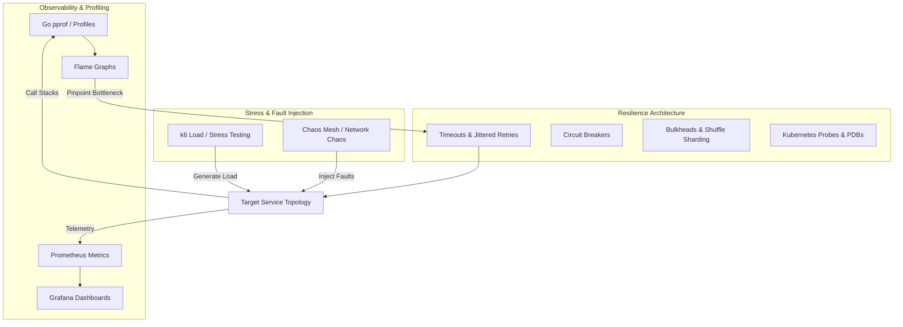

# Reliability Lab (`reliability-lab`)

> A hands-on engineering laboratory for learning how distributed systems fail and how to make them resilient.

Reliability cannot be learned purely by reading theory. This repository is built around a practical engineering loop:

```text
Build
  ↓
Load
  ↓
Observe
  ↓
Break
  ↓
Measure
  ↓
Diagnose
  ↓
Improve
  ↓
Repeat
```

Instead of abstract definitions, this lab deliberately introduces real-world failure modes—such as tail latency, retry storms, thread starvation, CPU throttling, OOM kills, network packet loss, and split-brain scenarios—and uses observability and profiling to diagnose and mitigate them.

---

## Architecture & Learning Workflow



---

## Suggested Learning Path

While each directory is self-contained, following this progression connects telemetry, diagnostics, and defensive architectural patterns in logical sequence:

```text
1. Observability
        ↓
2. Metrics + Prometheus
        ↓
3. Grafana
        ↓
4. Load Testing
        ↓
5. Profiling
        ↓
6. Flame Graphs
        ↓
7. Failure Handling
        ↓
8. Chaos Engineering
        ↓
9. Failure Isolation
        ↓
10. Kubernetes Reliability
        ↓
11. High Availability
        ↓
12. SLOs and Error Budgets
```

Detailed guide: [docs/learning-path.md](file:///docs/learning-path.md)

---

## Repository Structure

| Section | Focus Area | Description |
|---|---|---|
| [`docs/`](file:///docs/) | Concepts & Reference | [Reliability Engineering](file:///docs/reliability-engineering.md), [Glossary](file:///docs/glossary.md), [Learning Path](file:///docs/learning-path.md) |
| [`observability/`](file:///observability/README.md) | Telemetry & Signals | [Prometheus](file:///observability/prometheus/README.md), [Grafana](file:///observability/grafana/README.md), [Logging](file:///observability/logging/README.md), [Tracing](file:///observability/tracing/README.md), [OpenTelemetry](file:///observability/opentelemetry/README.md), [Continuous Profiling](file:///observability/continuous-profiling/README.md) |
| [`profiling/`](file:///profiling/README.md) | Runtime Diagnostics | [CPU](file:///profiling/cpu/README.md), [Wall-clock](file:///profiling/wall-clock/README.md), [Async-aware](file:///profiling/async-aware/README.md), [Memory](file:///profiling/memory/README.md), [Allocations](file:///profiling/allocations/README.md), [Blocking](file:///profiling/blocking/README.md), [Mutex Contention](file:///profiling/mutex-contention/README.md), [Flame Graphs](file:///profiling/flamegraphs/README.md) |
| [`performance-testing/`](file:///performance-testing/README.md) | Load & Saturation | [Smoke](file:///performance-testing/smoke-testing/README.md), [Load](file:///performance-testing/load-testing/README.md), [Stress](file:///performance-testing/stress-testing/README.md), [Spike](file:///performance-testing/spike-testing/README.md), [Soak](file:///performance-testing/soak-testing/README.md), [k6 Harness](file:///performance-testing/k6/README.md) |
| [`chaos-engineering/`](file:///chaos-engineering/README.md) | Fault Injection | [Chaos Mesh](file:///chaos-engineering/chaos-mesh/README.md), [Chaos Monkey](file:///chaos-monkey/README.md), [Pod Failures](file:///chaos-engineering/pod-failures/README.md), [Network Failures](file:///chaos-engineering/network-failures/README.md), [Resource Pressure](file:///chaos-engineering/resource-pressure/README.md), [Dependency Failures](file:///chaos-engineering/dependency-failures/README.md) |
| [`failure-handling/`](file:///failure-handling/README.md) | Resilience Patterns | [Retries](file:///failure-handling/retries/README.md), [Retry Amplification](file:///failure-handling/retry-amplification/README.md), [Retry Ownership](file:///failure-handling/retry-ownership/README.md), [Timeouts](file:///failure-handling/timeouts/README.md), [Backoff & Jitter](file:///failure-handling/backoff-and-jitter/README.md), [Circuit Breakers](file:///failure-handling/circuit-breakers/README.md), [Idempotency](file:///failure-handling/idempotency/README.md), [Dead-Letter Queues](file:///failure-handling/dead-letter-queues/README.md), [Graceful Degradation](file:///failure-handling/graceful-degradation/README.md) |
| [`failure-isolation/`](file:///failure-isolation/README.md) | Blast Radius Control | [Blast Radius](file:///failure-isolation/blast-radius/README.md), [Bulkheads](file:///failure-isolation/bulkheads/README.md), [Shuffle Sharding](file:///failure-isolation/shuffle-sharding/README.md), [Tenant Isolation](file:///failure-isolation/tenant-isolation/README.md) |
| [`kubernetes-reliability/`](file:///kubernetes-reliability/README.md) | Orchestration Reliability | [Probes](file:///kubernetes-reliability/probes/README.md), [Requests & Limits](file:///kubernetes-reliability/resource-requests-limits/README.md), [PDBs](file:///kubernetes-reliability/pod-disruption-budgets/README.md), [Graceful Termination](file:///kubernetes-reliability/graceful-termination/README.md), [Autoscaling](file:///kubernetes-reliability/autoscaling/README.md), [Topology Spread](file:///kubernetes-reliability/topology-spread/README.md), [Scheduling](file:///kubernetes-reliability/scheduling/README.md), [Node Failures](file:///kubernetes-reliability/node-failures/README.md) |
| [`networking/`](file:///networking/README.md) | Network Reliability | [DNS](file:///networking/dns/README.md), [Load Balancing](file:///networking/load-balancing/README.md), [Envoy](file:///networking/envoy/README.md), [Service Mesh](file:///networking/service-mesh/README.md), [Network Partitions](file:///networking/network-partitions/README.md), [TLS/mTLS](file:///networking/tls-mtls/README.md) |
| [`high-availability/`](file:///high-availability/README.md) | Data Systems HA | [Replication](file:///high-availability/replication/README.md), [Leader Election](file:///high-availability/leader-election/README.md), [Failover](file:///high-availability/failover/README.md), [PostgreSQL HA](file:///high-availability/postgres/README.md) |
| [`scaling/`](file:///scaling/README.md) | Capacity & Elasticity | [HPA](file:///scaling/hpa/README.md), [KEDA](file:///scaling/keda/README.md), [Queue-based Scaling](file:///scaling/queue-based-scaling/README.md), [Capacity Planning](file:///scaling/capacity-planning/README.md), [Saturation](file:///scaling/saturation/README.md) |
| [`sre-fundamentals/`](file:///sre-fundamentals/README.md) | Service Level Objectives | [Golden Signals](file:///sre-fundamentals/golden-signals/README.md), [SLIs](file:///sre-fundamentals/sli/README.md), [SLOs](file:///sre-fundamentals/slo/README.md), [SLAs](file:///sre-fundamentals/sla/README.md), [Error Budgets](file:///sre-fundamentals/error-budgets/README.md), [Burn Rates](file:///sre-fundamentals/burn-rate/README.md), [Reliability Metrics](file:///sre-fundamentals/reliability-metrics/README.md) |
| [`experiments/`](file:///experiments/README.md) | Hands-On Labs | Reproducible experiments demonstrating failure modes under load. |
| [`notes/`](file:///notes/README.md) | Field Observations | Lightweight engineering notes documenting real incident observations and lessons. |

---

## Flagship Experiments Index

Each experiment in [`experiments/`](file:///experiments/README.md) follows a standardized format:

1. [Retry Ownership & Amplification](file:///experiments/retry-ownership/README.md) – How multi-layer retries multiply traffic and how assigning single-layer ownership eliminates retry storms.
2. [Retry Storm & Jitter Breakdown](file:///experiments/retry-storm/README.md) – Synchronized retries without jitter causing complete cluster collapse under transient load.
3. [Kubernetes Pod Failure under Load](file:///experiments/pod-failure/README.md) – Measuring error spikes during pod termination without readiness probes and PDBs.
4. [Downstream Network Latency Injection](file:///experiments/network-latency/README.md) – Injecting millisecond delays to observe connection pool exhaustion and thread starvation.
5. [Network Packet Loss Degradation](file:///experiments/packet-loss/README.md) – TCP retransmissions, latency amplification, and throughput collapse.
6. [CPU Bottleneck & Flame Graph Profiling](file:///experiments/cpu-bottleneck/README.md) – Identifying quadratic time complexity using Go pprof and flame graphs.
7. [Memory Pressure & OOMKill (Exit 137)](file:///experiments/memory-pressure/README.md) – Heap growth, garbage collection thrashing, and Linux cgroup termination.
8. [Database Leader Failover & RTO](file:///experiments/database-failover/README.md) – Measuring write downtime and client errors during primary failover.
9. [Load Test to Profiling Closed Loop](file:///experiments/load-test-and-profile/README.md) – Connecting k6 load generation $\to$ Prometheus metrics $\to$ pprof diagnostics.
10. [Shuffle Sharding Simulation](file:///experiments/shuffle-sharding/README.md) – Reducing customer blast radius from 100% to < 5% via combinatorial subset routing.

---

## Prerequisites & Tooling

Designed for local environments:
- **Go** (1.22+)
- **Node.js** (v18+)
- **Python** (3.10+)
- **Docker & Docker Compose**
- **kubectl** & **kind**
- **k6**

---

## Roadmap & Status

Track module implementation statuses in [ROADMAP.md](file:///ROADMAP.md).

## Contributing

Review guidelines in [CONTRIBUTING.md](file:///CONTRIBUTING.md).

## License

[MIT](file:///LICENSE)
