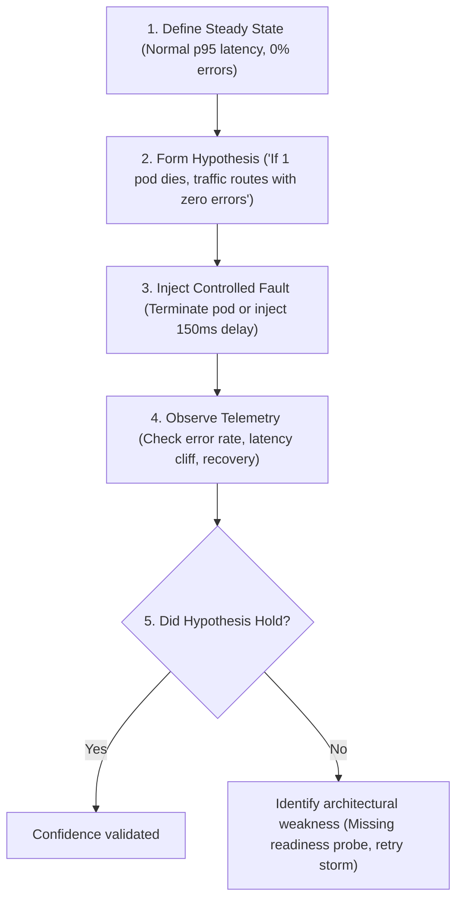

# Chaos Engineering

Chaos Engineering is the discipline of experimenting on a software system to build confidence in its capability to withstand turbulent conditions in production.

It is **not** randomly breaking production; it is a hypothesis-driven empirical process.

---

## The Scientific Method of Chaos

---

## Executable Labs

- [Chaos Mesh on Local Kubernetes](chaos-mesh/README.md) – End-to-end lab on `kind` demonstrating `PodChaos` and `NetworkChaos`.

*(Future chaos patterns such as instance termination and cloud-level failure injection are tracked in [ROADMAP.md](../ROADMAP.md))*.
