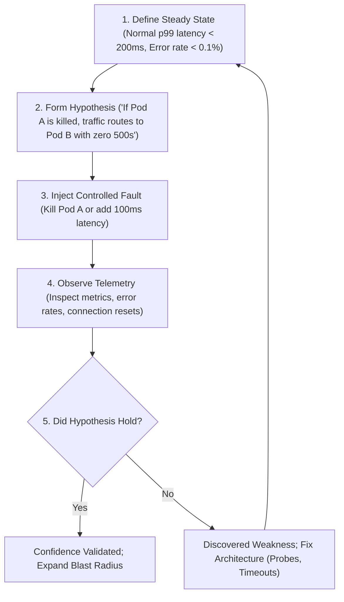

# Chaos Engineering

Chaos Engineering is the discipline of experimenting on a system in order to build confidence in the system's capability to withstand turbulent conditions in production.

It is **not** randomly breaking things in production. It is a rigorous scientific process.

---

## The Scientific Method of Chaos

---

## Tooling Landscape

| Tool | Scope & Architecture | Best For |
|---|---|---|
| **Chaos Mesh** | Kubernetes-native CRD controller using eBPF, iptables, cgroups | Container kills, network delays, packet loss, DNS faults, stress |
| **Chaos Monkey** | Cloud VM / AWS ASG instance terminator (Netflix) | Random instance termination in multi-zone cloud pools |
| **LitmusChaos** | Cloud Native Computing Foundation (CNCF) chaos framework | Workflow-driven enterprise Kubernetes experiments |
| **Gremlin** | Enterprise SaaS agent platform | Multi-cloud managed game days |

---

## Safety & Blast Radius Controls

1. **Always Define a Rollback Plan**: Every chaos CRD or script must have an immediate cancellation mechanism (`kubectl delete`).
2. **Automated Abort Conditions**: Tie experiments to Prometheus metric triggers. If overall system error rate exceeds 5%, immediately abort the fault injection.
3. **Isolate to Staging / Kind**: Run experiments in isolated local `kind` clusters before running them in shared staging environments.

---

## Directory Index

- [`chaos-mesh/`](file:///chaos-engineering/chaos-mesh/README.md) – Installing and using Chaos Mesh on kind.
- [`chaos-monkey/`](file:///chaos-engineering/chaos-monkey/README.md) – Netflix instance termination patterns.
- [`pod-failures/`](file:///chaos-engineering/pod-failures/README.md) – PodKill and PodFailure experiments.
- [`network-failures/`](file:///chaos-engineering/network-failures/README.md) – Network delay, packet loss, and partition chaos.
- [`resource-pressure/`](file:///chaos-engineering/resource-pressure/README.md) – StressChaos (CPU throttling and memory limits).
- [`dependency-failures/`](file:///chaos-engineering/dependency-failures/README.md) – HTTPChaos injecting 500s into downstream dependencies.
