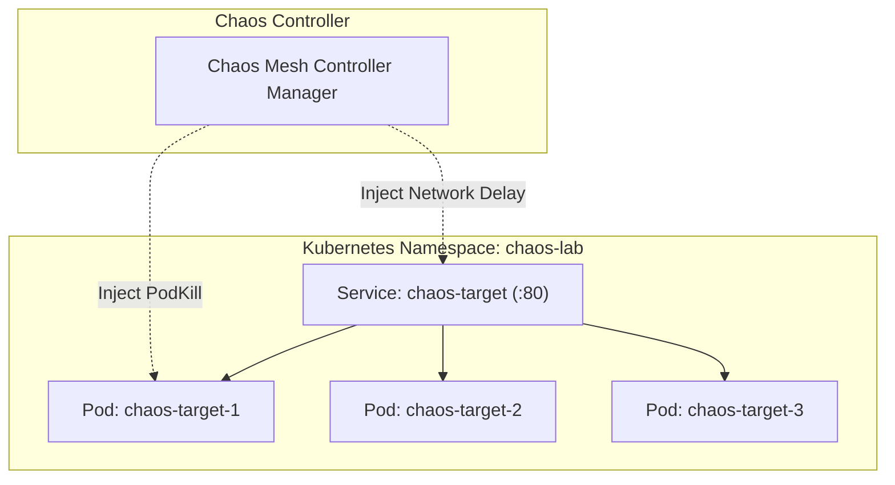

# Local Kubernetes Chaos Engineering with Chaos Mesh

This lab demonstrates how to execute controlled fault injection experiments on a local Kubernetes cluster using [Chaos Mesh](https://chaos-mesh.org/) and [`kind`](https://kind.sigs.k8s.io/).

> [!CAUTION]
> These manifests are intended exclusively for isolated, disposable local or sandbox environments (`kind`, `k3d`, minikube). Never apply unreviewed chaos experiments directly against shared staging or production clusters.

---

## Lab Architecture



- **Target App**: Deployment of 3 replicas running an echo HTTP server ([k8s/deployment.yaml](k8s/deployment.yaml)).
- **Namespace**: `chaos-lab` ([k8s/namespace.yaml](k8s/namespace.yaml)) with label `chaos-mesh.org/inject: enabled`.
- **Fault 1**: [experiments/pod-kill.yaml](experiments/pod-kill.yaml) – Randomly kills one target pod every 30 seconds.
- **Fault 2**: [experiments/network-delay.yaml](experiments/network-delay.yaml) – Injects 150ms $\pm$ 20ms network latency into target traffic.

---

## Step-by-Step Lab Workflow

### Step 1: Create a Local `kind` Cluster
Ensure Docker and `kind` are installed:
```bash
kind create cluster --name chaos-lab
```

### Step 2: Install Chaos Mesh
Install Chaos Mesh using its official installer script:
```bash
curl -sSL https://mirrors.chaos-mesh.org/v2.6.2/install.sh | bash -s -- --local kind
```
Verify the Chaos Mesh pods are running:
```bash
kubectl get pods -n chaos-mesh
```

### Step 3: Deploy the Target Application
Apply the namespace, deployment, and service manifests:
```bash
kubectl apply -f chaos-engineering/chaos-mesh/k8s/
```
Wait for all 3 pods to be ready:
```bash
kubectl get pods -n chaos-lab -l app=chaos-target
```

### Step 4: Confirm Healthy Steady State
Port-forward the target service to verify normal response:
```bash
kubectl port-forward -n chaos-lab svc/chaos-target 8088:80
```
In another terminal, test the endpoint:
```bash
curl http://localhost:8088/
```
Healthy response:
```text
chaos-target-alive
```

### Step 5: Apply Pod Kill Chaos
Inject randomized pod termination:
```bash
kubectl apply -f chaos-engineering/chaos-mesh/experiments/pod-kill.yaml
```

**Observation**:
Monitor the pods in real time:
```bash
kubectl get pods -n chaos-lab -w
```
You will observe:
1. Chaos Mesh terminates one target pod.
2. The Deployment controller detects replica count dropping to 2 and immediately schedules a replacement pod.
3. Because the Service has `readinessProbe` enabled, client traffic is only routed to the 2 surviving healthy pods while the new pod initializes.

Remove the pod chaos experiment:
```bash
kubectl delete -f chaos-engineering/chaos-mesh/experiments/pod-kill.yaml
```

### Step 6: Apply Network Latency Chaos
Inject 150ms of network latency with 20ms jitter:
```bash
kubectl apply -f chaos-engineering/chaos-mesh/experiments/network-delay.yaml
```

**Observation**:
Measure HTTP response duration:
```bash
curl -w "\nTotal time: %{time_total}s\n" http://localhost:8088/
```
Latency climbs from $< 5\text{ms}$ baseline to $> 150\text{ms}$.

Remove the network chaos experiment:
```bash
kubectl delete -f chaos-engineering/chaos-mesh/experiments/network-delay.yaml
```

---

## Cleanup
Delete the application and cluster:
```bash
kubectl delete -f chaos-engineering/chaos-mesh/k8s/
kind delete cluster --name chaos-lab
```
