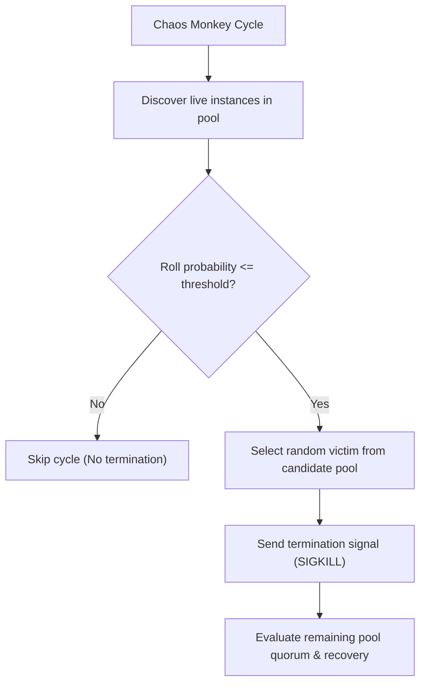

# Chaos Monkey: Instance Termination & Resilience

Chaos Monkey was originally developed by Netflix in 2011 as part of the "Simian Army" to enforce a culture of high availability.

Its premise was radical but practical: **by randomly terminating production virtual machine instances during business hours, engineers were forced to architect stateless, horizontally redundant, self-healing services.**

---

## Chaos Monkey vs General Chaos Platforms

| Characteristic | Chaos Monkey | General Chaos Platforms (Chaos Mesh, Litmus) |
|---|---|---|
| **Scope of Fault** | Instance / VM / Container termination (`SIGKILL`) | Network latency, packet loss, partitions, CPU stress, disk IO, DNS failures |
| **Execution Trigger** | Randomized schedule (e.g., during working hours) | Scenario-driven hypothesis tests, game days, CI pipelines |
| **Target Infrastructure** | Auto-scaling groups, cloud VM clusters, container pools | Kubernetes pods, kernel cgroups, eBPF network interfaces |
| **Primary Goal** | Enforce that no single node is a snowflake or single point of failure | Stress-test timeout budgets, circuit breakers, and tail latency |

---

## Local Runner Architecture

This Go implementation ([main.go](main.go)) operates in two modes:
1. **Simulated Mode (`-simulate=true`)**: Tests selection logic, probability rolls, and quorum metrics in-memory without requiring a Docker daemon.
2. **Container Pool Mode**: Discovers running containers matching `-target=worker-`, randomly evaluates termination probability, and terminates live instances.



---

## Running the Lab

### 1. Simulated In-Memory Execution
Run 5 evaluation rounds with an 80% termination probability per cycle:
```bash
cd chaos-engineering/chaos-monkey
go run main.go -simulate=true -rounds=5 -probability=0.8
```

Sample output:
```text
[STATUS] Active live instances in pool: 4
[KILL] Terminated simulated instance: worker-2 (sim-inst-02)
--- Cycle #2 ---
[STATUS] Active live instances in pool: 3
[KILL] Terminated simulated instance: worker-4 (sim-inst-04)
```

### 2. Live Docker Container Pool Execution
Launch a local pool of 3 worker services:
```bash
cd chaos-engineering/chaos-monkey
docker compose up -d
```

Verify the 3 containers are running:
```bash
docker ps --filter "name=worker-"
```

Run Chaos Monkey in **Dry-Run mode** to inspect targets safely:
```bash
go run main.go -target=chaos-monkey-worker -dry-run=true -rounds=3
```

Run Chaos Monkey in **Live mode**:
```bash
go run main.go -target=chaos-monkey-worker -probability=0.7 -rounds=3
```

Watch Docker automatically restart the terminated container due to `restart: on-failure`:
```bash
docker ps --filter "name=worker-"
```

---

## Cleanup
Tear down the worker container pool:
```bash
docker compose down
```
