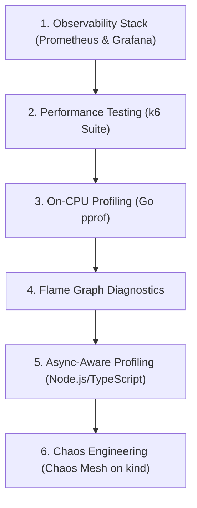

# Reliability Engineering Learning Path

This guide maps out a systematic path to master production reliability from first principles.

---

## Part 1: Implemented & Runnable Labs (v0.1)

Follow these runnable labs locally using Docker Compose, Go, Node.js, and kind.

### Module 1: Observability Stack (Prometheus + Grafana)
- **Concepts**: Metric types (Counter, Gauge, Histogram), scraping intervals, PromQL queries (`rate`, `histogram_quantile`), provisioned dashboards.
- **Directory**: [observability/](../observability/README.md)
- **Hands-On**: Start the stack with `docker compose up -d`, observe the demo application metrics, and inspect the provisioned Grafana dashboard.

### Module 2: Performance & Load Testing with k6
- **Concepts**: Smoke testing, load testing, stress testing, and spike testing. Tail percentiles ($p95$, $p99$) vs misleading arithmetic averages.
- **Directory**: [performance-testing/k6/](../performance-testing/k6/README.md)
- **Hands-On**: Run `smoke.js`, `load.js`, and `stress.js` against the observability demo app while watching real-time latency divergence in Grafana.

### Module 3: On-CPU Profiling with Go `pprof`
- **Concepts**: Statistical stack sampling, identifying CPU hotspots, understanding `flat` vs `cum` execution times.
- **Directory**: [profiling/cpu/](../profiling/cpu/README.md)
- **Hands-On**: Run the CPU target app, inject traffic via `load.js`, collect a 20-second profile, and inspect `expensiveComputation()` using `go tool pprof`.

### Module 4: Flame Graph Analysis
- **Concepts**: Call stack hierarchy, frame width representing sampled time, identifying plateaus, and comparing differential flame graphs.
- **Directory**: [profiling/flamegraphs/](../profiling/flamegraphs/README.md)
- **Hands-On**: Open `http://localhost:8081/ui/flamegraph` on the CPU target app, optimize the sorting routine, and verify that the bottleneck frame collapses.

### Module 5: Async-Aware Profiling
- **Concepts**: The distinction between CPU time and wall-clock elapsed time in asynchronous runtimes. Single-threaded event loop starvation.
- **Directory**: [profiling/async-aware/](../profiling/async-aware/README.md)
- **Hands-On**: Compare synchronous CPU-bound blocks (`/cpu`) against asynchronous I/O waiting (`/io`) in a TypeScript service.

### Module 6: Chaos Engineering on Kubernetes
- **Concepts**: Controlled hypothesis-driven fault injection. Steady-state verification. Pod termination and network latency injection.
- **Directory**: [chaos-engineering/chaos-mesh/](../chaos-engineering/chaos-mesh/README.md)
- **Hands-On**: Spin up a local `kind` cluster, install Chaos Mesh, deploy the 3-replica echo application, and apply `PodChaos` and `NetworkChaos`.

---

## Part 2: Planned Architectural Progression (Future)

These topics represent subsequent modules planned for development in [ROADMAP.md](../ROADMAP.md):

- **Failure Handling**: Timeouts, exponential backoff, randomized jitter, circuit breakers, idempotency keys, dead-letter queues.
- **Failure Isolation**: Bulkheads, tenant quotas, shuffle sharding simulations.
- **Kubernetes Reliability**: Startup/liveness/readiness probes, CPU throttling (CFS quota) vs OOMKills, PodDisruptionBudgets, graceful termination.
- **High Availability**: Replication lag, consensus leader election, automated failover, split-brain fencing.
- **SRE Fundamentals**: Four Golden Signals, SLIs, SLOs, SLAs, error budgets, and multi-window multi-burn-rate alerting.
