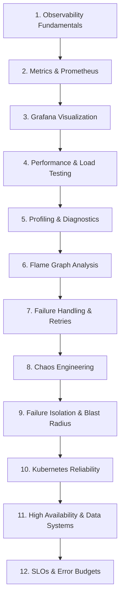

# Reliability Engineering Learning Path

This guide maps out a systematic path to master production reliability from first principles. While you are free to explore individual modules as needed, following this progression connects telemetry, diagnostics, and defensive architectural patterns in logical sequence.

---

## Progression Overview

---

## Module 1: Observability Fundamentals
- **Core Concept**: Distinguish the four pillars of telemetry: Metrics (*What is happening?*), Logs (*What happened?*), Traces (*Where was time spent?*), and Profiles (*What code is executing?*).
- **Directory**: [`observability/`](file:///observability/README.md)
- **Checkpoint**: Explain why adding more debug logs often worsens performance during high-throughput outages.

## Module 2: Metrics & Prometheus
- **Core Concept**: Time-series storage, scrapers, pull architecture, metric types (Counter, Gauge, Histogram, Summary). PromQL rate calculations, histogram quantile calculations ($p95$, $p99$), and metric cardinality dangers.
- **Directory**: [`observability/prometheus/`](file:///observability/prometheus/README.md)
- **Lab**: Inspect metrics on `http://localhost:8080/metrics` and run Prometheus queries in `observability/prometheus/`.

## Module 3: Grafana Visualization
- **Core Concept**: Building dashboards around the **Four Golden Signals** (Latency, Traffic, Errors, Saturation). Panel queries, variables, and alerts.
- **Directory**: [`observability/grafana/`](file:///observability/grafana/README.md)
- **Lab**: Import the sample dashboard from `observability/grafana/dashboards/reliability-overview.json`.

## Module 4: Performance & Load Testing
- **Core Concept**: Smoke tests, stress tests, spike tests, and soak tests. Understanding why arithmetic averages hide tail latency. Correlating request rate with saturation cliffs.
- **Directory**: [`performance-testing/`](file:///performance-testing/README.md)
- **Lab**: Run [`performance-testing/k6/load-test.js`](file:///performance-testing/k6/load-test.js) against the sample application.

## Module 5: Profiling & Runtime Diagnostics
- **Core Concept**: On-CPU profiling vs wall-clock profiling. Why an asynchronous system (Node.js/Python/Go) can be slow even when CPU utilization is $< 10\%$.
- **Directory**: [`profiling/`](file:///profiling/README.md)
- **Lab**: Run Go `pprof` CPU sample analysis in [`profiling/cpu/`](file:///profiling/cpu/README.md) and async diagnostics in [`profiling/async-aware/`](file:///profiling/async-aware/README.md).

## Module 6: Flame Graph Analysis
- **Core Concept**: Stack sampling, understanding that frame width represents time/samples while height represents call depth. Identifying hot paths and false leads.
- **Directory**: [`profiling/flamegraphs/`](file:///profiling/flamegraphs/README.md)
- **Experiment**: Run [`experiments/cpu-bottleneck/`](file:///experiments/cpu-bottleneck/README.md) to generate, optimize, and compare flame graphs.

## Module 7: Failure Handling Patterns
- **Core Concept**: Bounded timeouts, exponential backoff, randomized jitter, circuit breaker state transitions (Closed $\to$ Open $\to$ Half-Open), and idempotency keys.
- **Directory**: [`failure-handling/`](file:///failure-handling/README.md)
- **Flagship Experiment**: Run [`experiments/retry-ownership/`](file:///experiments/retry-ownership/README.md) to witness retry storms and retry amplification across a 4-tier microservice chain.

## Module 8: Chaos Engineering
- **Core Concept**: Controlled fault injection. Hypothesis-driven testing. Injecting Pod kills, packet loss, and millisecond latency delays using Chaos Mesh on Kubernetes.
- **Directory**: [`chaos-engineering/`](file:///chaos-engineering/README.md)
- **Labs**: Run [`experiments/pod-failure/`](file:///experiments/pod-failure/README.md) and [`experiments/network-latency/`](file:///experiments/network-latency/README.md).

## Module 9: Failure Isolation & Blast Radius
- **Core Concept**: Bulkheads, failure domains, tenant isolation, and Shuffle Sharding.
- **Directory**: [`failure-isolation/`](file:///failure-isolation/README.md)
- **Simulation**: Run [`experiments/shuffle-sharding/`](file:///experiments/shuffle-sharding/README.md) to see how small deterministic subsets reduce customer blast radius from $100\%$ to $< 5\%$.

## Module 10: Kubernetes Reliability
- **Core Concept**: Startup, Readiness, and Liveness probes. CPU CFS throttling vs Memory OOMKills. PodDisruptionBudgets and graceful termination (SIGTERM draining).
- **Directory**: [`kubernetes-reliability/`](file:///kubernetes-reliability/README.md)
- **Labs**: Review probes in [`kubernetes-reliability/probes/`](file:///kubernetes-reliability/probes/README.md) and resource quotas in [`kubernetes-reliability/resource-requests-limits/`](file:///kubernetes-reliability/resource-requests-limits/README.md).

## Module 11: High Availability & Data Systems
- **Core Concept**: Replication lag, consensus, leader election, fencing, split-brain hazards, RTO, and RPO.
- **Directory**: [`high-availability/`](file:///high-availability/README.md)
- **Lab**: Inspect PostgreSQL HA architecture and failover timeline in [`high-availability/postgres/`](file:///high-availability/postgres/README.md).

## Module 12: SRE Fundamentals, SLOs & Error Budgets
- **Core Concept**: Math of Service Level Objectives (SLOs), calculating error budgets, and configuring multi-window multi-burn-rate alerting.
- **Directory**: [`sre-fundamentals/`](file:///sre-fundamentals/README.md)
- **Guide**: Work through [`sre-fundamentals/burn-rate/`](file:///sre-fundamentals/burn-rate/README.md).
