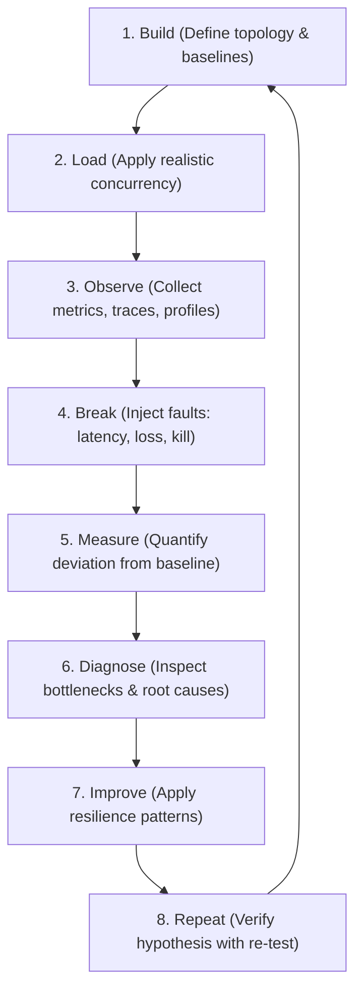
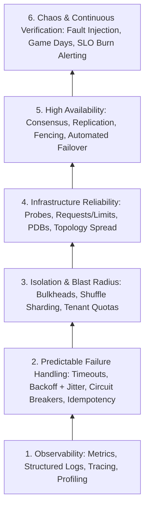

# Software Reliability & Production Engineering

Software Reliability Engineering (SRE) and Production Engineering are disciplines focused on keeping software systems operating correctly, predictably, and within defined thresholds under real-world conditions.

Reliability is not a feature you add at the end of a project. It is an emergent property of how a system handles stress, latency, partial degradation, resource exhaustion, and operator error.

---

## The Core Philosophy

> **Learn reliability engineering by deliberately breaking, observing, measuring, and improving systems.**

Reading theoretical definitions of circuit breakers, rate limiters, or timeouts provides an illusion of understanding. In practice, failure modes in distributed systems are counterintuitive:
- Adding retries to a slow service often destroys the service entirely via retry amplification.
- Adding auto-scaling can overwhelm downstream databases before instances become ready.
- Adding redundant nodes can worsen availability if leader failover mechanisms experience split-brain or flap under packet loss.

To understand these dynamics, we adopt an empirical engineering loop:

---

## Why Production Systems Fail

In single-node software, errors are generally binary: code either returns a result or crashes. In distributed systems, failure is continuous, partial, and asynchronous.

### 1. Partial Failures and Gray Failures
A node rarely dies cleanly. Instead, it slows down, drops 5% of packets, exhausts file descriptors, or spends 90% of its time in garbage collection pauses. Upstream services continue sending traffic to it, filling client connection pools and exhausting thread pools while waiting for timeouts.

### 2. Tail Latency Amplification
In a fan-out architecture where a single user request calls 50 backend services in parallel, the latency of the request is governed by the 98th or 99th percentile of the slowest dependency ($P(\text{slow}) = 1 - (1 - p)^N$). If individual services have a 1% chance of taking 2 seconds, the composite request has a $\approx 40\%$ chance of taking 2 seconds.

### 3. Cascading Failures and Positive Feedback Loops
When one replica in an $N$-node cluster fails or slows down, load balancers redistribute its traffic across the remaining $N-1$ replicas. If the cluster was operating near saturation, the remaining replicas now receive higher load, causing another replica to fail. This positive feedback loop repeats until the entire tier collapses.

### 4. Retry Storms and Queue Explosions
When requests fail due to downstream overload, clients without jittered backoff or retry budgets immediately retry. This multiplies incoming traffic precisely when downstream capacity is degraded, converting a temporary minor latency spike into an unrecoverable outage.

---

## The Hierarchy of Reliability

Reliability engineering is built in layers. Attempting to introduce advanced patterns without solid foundations produces fragile systems:

---

## Golden Rules for Production Engineering

1. **Every network call must have a bounded timeout.** A call without a timeout is a latent thread/connection leak waiting to take down the process.
2. **Never retry without exponential backoff and randomized jitter.** Synchronized retries create devastating thundering herds.
3. **Retries must have ownership.** If 3 tiers in a call chain each retry 3 times, a single failed call produces $3 \times 3 \times 3 = 27$ downstream calls. Only one tier should own retries for a given dependency failure.
4. **Operations must be idempotent before they are retried.** Retrying a non-idempotent operation risks double-charging payments, duplicate orders, or corrupted state.
5. **Averages are malicious.** Mean latency hides tail latency. Always measure and alert on percentiles: $p50$, $p95$, $p99$, and $p99.9$.
6. **Graceful degradation over catastrophic collapse.** If a recommendation engine fails, return a static default list; do not crash the checkout flow.
7. **Bound all queues and buffers.** Unbounded queues consume infinite memory, induce latency spikes, and eventually trigger OOMKills. Drop or reject requests early (load shedding) rather than queuing indefinitely.
