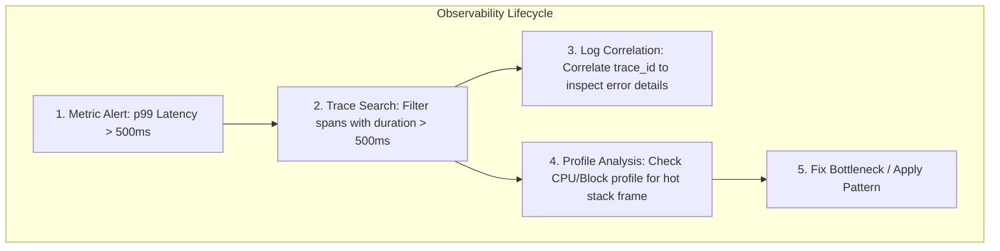

# Observability: The Four Pillars

Observability is the degree to which you can infer the internal state of a production system solely from its external outputs. In distributed systems, observability is built upon four distinct telemetry signals:

| Pillar | Fundamental Question | Temporal Granularity | Overhead & Cardinality |
|---|---|---|---|
| **Metrics** | *What is happening right now?* | Aggregated numeric time series (seconds) | Lowest storage cost; susceptible to high cardinality blowup |
| **Logs** | *What happened at a specific moment?* | Discrete textual event streams (milliseconds) | High volume; requires indexers (Loki, Elasticsearch) |
| **Traces** | *Where did a distributed request spend its time?* | Causal directed acyclic graph (per request) | Medium to high; requires head/tail sampling in high throughput |
| **Profiles** | *What is the code doing internally right now?* | Call stack sample distributions (nanoseconds) | Continuous sampling (~1-2% CPU overhead); pinpoints exact lines of code |

---

## Telemetry Relationship Diagram



---

## 1. Metrics: "What is happening?"
Metrics are aggregated numeric measurements recorded over regular time intervals. They are ideal for:
- Detecting degradation before customers report outages.
- Powering alerting rules and SLO error budget accounting.
- Identifying overall cluster saturation (CPU, RAM, queue depths).

Implemented in this repository:
- [Prometheus Guide & Rules](prometheus/README.md)
- [Grafana Provisioning & Dashboards](grafana/README.md)
- [Demo Application](demo-app/)

---

## 2. Logs, Traces & Continuous Profiling

- **Logs**: Discrete event records with structured fields (`timestamp`, `level`, `trace_id`).
- **Distributed Traces**: Request path graphs tracking latency across service boundaries.
- **Continuous Profiling**: Always-on stack sampling in production (e.g. Pyroscope, Parca).

*(Planned for future modules in [ROADMAP.md](../ROADMAP.md))*.

---

## Quickstart: Runnable Observability Stack

Launch Prometheus, Grafana, and the instrumented demo application:

```bash
docker compose -f observability/docker-compose.yml up -d
```

- **Prometheus UI**: `http://localhost:9090`
- **Grafana UI**: `http://localhost:3000` (User: `admin`, Password: `admin`)
- **Demo App Metrics**: `http://localhost:8080/metrics`
- **Demo App Workload**: `http://localhost:8080/work`
