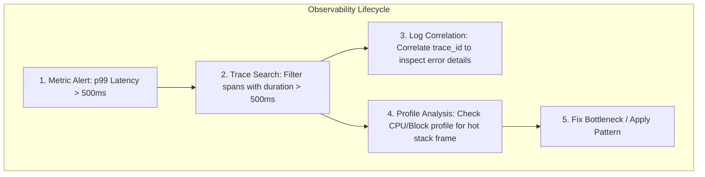

# Observability: The Four Pillars

Observability is the degree to which you can infer the internal state of a production system solely from its external outputs. In modern distributed systems, observability is built upon four distinct telemetry signals:

| Pillar | Fundamental Question | Temporal Granularity | Overhead & Cardinality |
|---|---|---|---|
| **Metrics** | *What is happening right now?* | Aggregated numeric time series (seconds) | Lowest storage cost; susceptible to high cardinality blowup |
| **Logs** | *What happened at a specific moment?* | Discrete textual event streams (milliseconds) | High volume; requires indexers (Loki, Elasticsearch) |
| **Traces** | *Where did a distributed request spend its time?* | Causal directed acyclic graph (per request) | Medium to high; requires head/tail sampling in high throughput |
| **Profiles** | *What is the code doing internally right now?* | Call stack sample distributions (nanoseconds) | Continuous sampling (~1-2% CPU overhead); pinpoints exact lines of code |

---

## Telemetry Relationship Diagram



---

## 1. Metrics: "What is happening?"
Metrics are aggregated numeric measurements recorded over regular time intervals. They are ideal for:
- Detecting degradation before customers report outages.
- Powering alerting rules and SLO error budget accounting.
- Identifying overall cluster saturation (CPU, RAM, queue depths).

However, metrics alone cannot explain **why** a specific customer request failed or which internal function consumed CPU.
See [`observability/prometheus/`](file:///observability/prometheus/README.md).

---

## 2. Logs: "What happened?"
Logs are timestamped records of discrete events (e.g., `"Order 91823 failed validation: negative quantity"`).
- **Unstructured logs** (`log.Printf("error: %v", err)`) are difficult to query and parse at scale.
- **Structured logs** (JSON objects with fixed schema fields: `timestamp`, `level`, `trace_id`, `tenant_id`, `message`) enable automated filtering and indexing.

Logs provide contextual detail for an individual event, but collecting and storing full logs for billions of requests creates massive storage and ingestion costs.
See [`observability/logging/`](file:///observability/logging/README.md).

---

## 3. Distributed Traces: "Where did the request spend its time?"
Traces follow a single request as it crosses process, container, and network boundaries:
- A **Trace** represents the complete transaction journey.
- A **Span** represents a contiguous unit of work within a single service (e.g., executing an SQL query, waiting on HTTP response).
- Spans contain causal parent-child relationships, start times, durations, and context metadata.

Tracing answers: *Did the 800ms delay occur in the API gateway, the auth service, the database query, or the serialization routine?*
See [`observability/tracing/`](file:///observability/tracing/README.md) and [`observability/opentelemetry/`](file:///observability/opentelemetry/README.md).

---

## 4. Continuous Profiles: "What is the program doing internally?"
Even if a trace reveals that a specific service took 450ms, it does not reveal what the CPU cores, memory allocator, or operating system threads were doing during that span.
Profiles sample the running execution stack:
- **CPU Profiling**: Which functions occupied CPU registers.
- **Wall-Clock Profiling**: Where elapsed wall time was spent (including idle waiting).
- **Heap / Allocation Profiling**: Which functions allocated heap objects and triggered garbage collection pauses.
- **Mutex / Block Profiling**: Which locks caused goroutines or threads to stall.

See [`observability/continuous-profiling/`](file:///observability/continuous-profiling/README.md) and [`profiling/`](file:///profiling/README.md).

---

## Quickstart: Runnable Observability Stack

Launch the bundled Prometheus, Grafana, and instrumented demo application:

```bash
docker compose -f observability/docker-compose.yml up -d
```

- **Prometheus UI**: `http://localhost:9090`
- **Grafana UI**: `http://localhost:3000` (User: `admin`, Password: `admin`)
- **Demo App Metrics**: `http://localhost:8080/metrics`
- **Demo App pprof**: `http://localhost:8080/debug/pprof/`
