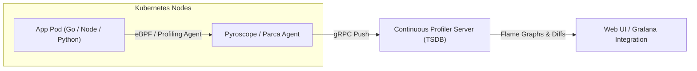

# Continuous Profiling in Production

Continuous profiling is the practice of continuously collecting runtime call-stack sample distributions across production services with minimal overhead (~1-2%), storing them in a dedicated queryable database.

---

## Why Ad-Hoc Profiling Fails in Production

Traditional profiling requires an engineer to notice degradation, log into a production host, capture a 30-second `pprof` profile, and download it. This approach suffers from critical limitations:
1. **Transient Spikes**: CPU spikes lasting 5 seconds have already subsided by the time an engineer connects.
2. **Heisenbug Effect**: Attaching heavy debuggers or invasive profilers alters runtime timing and masks synchronization race conditions.
3. **No Historical Comparison**: You cannot easily compare the call stack during today's incident with the baseline call stack from yesterday before the release.

---

## Continuous Profiling Architecture

Modern continuous profiling tools (such as **Grafana Pyroscope** and **Parca**) use low-overhead statistical sampling:

---

## Comparison: Pyroscope vs Parca

| Feature | Grafana Pyroscope | Parca |
|---|---|---|
| **Primary Mechanism** | Language-level runtime agents + eBPF | eBPF-native kernel sampling |
| **Kernel Requirement** | Any modern Linux (eBPF optional) | Linux kernel 4.19+ with BTF support |
| **Language Support** | Go, Java, Python, Node.js, Ruby, Rust, .NET | Any compiled language (C, C++, Go, Rust) via DWARF symbols |
| **Storage Backend** | Block-based time series object store | Parquet columnar storage / Prometheus-like TSDB |

---

## Differential Profiling (Diff Flame Graphs)

The primary diagnostic advantage of continuous profiling is comparing two time windows:
- **Baseline Profile**: Tuesday 14:00 (healthy deployment v1.2)
- **Degraded Profile**: Wednesday 14:00 (high latency deployment v1.3)

A **Diff Flame Graph** shows:
- **Red Frames**: Functions whose CPU or memory allocation percentage increased.
- **Blue Frames**: Functions whose resource consumption decreased.

This allows engineers to pinpoint the exact commit or regex parsing change that introduced a 15% CPU regression without writing specialized benchmarks.
