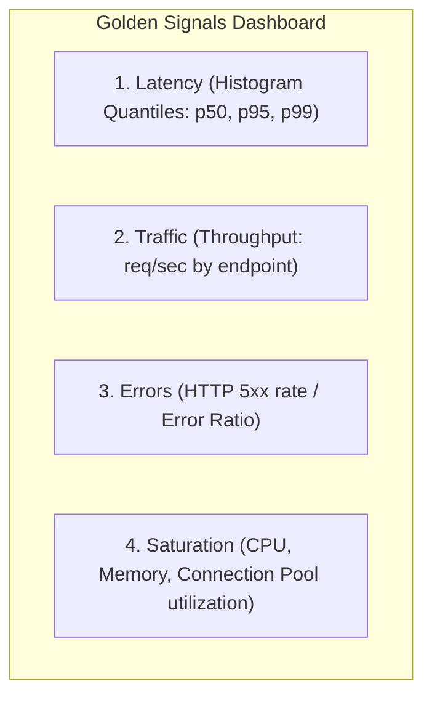

# Grafana: Dashboards, Panels & Golden Signals

Grafana transforms time-series metrics from Prometheus into operational visualizations for monitoring system health and diagnosing degradation.

---

## The Four Golden Signals on Grafana

Google's SRE framework identifies four primary signals to monitor for any user-facing service:



### 1. Latency Panel
Never plot simple averages. Averages hide extreme tail delays ($p99$).
- **Panel Type**: Time Series
- **PromQL Query**:
  ```promql
  histogram_quantile(0.99, sum(rate(http_request_duration_seconds_bucket{job="sample-app"}[2m])) by (le))
  ```
- **Thresholds**: Green $< 200\text{ms}$, Yellow $200\text{ms} - 500\text{ms}$, Red $> 500\text{ms}$.

### 2. Traffic (Throughput) Panel
Measures real-time demand on the service.
- **PromQL Query**:
  ```promql
  sum(rate(http_requests_total{job="sample-app"}[1m])) by (method, path)
  ```

### 3. Error Rate Panel
Exposes the ratio of failing requests to total requests.
- **PromQL Query**:
  ```promql
  sum(rate(http_requests_total{job="sample-app", status=~"5.."}[1m]))
  /
  sum(rate(http_requests_total{job="sample-app"}[1m]))
  ```
- **Unit**: Percent ($0.0 - 1.0$)

### 4. Saturation Panel
Measures how close resources are to full utilization before queueing begins.
- **CPU Saturation Query**:
  ```promql
  rate(container_cpu_usage_seconds_total{container="sample-app"}[1m])
  /
  container_spec_cpu_quota{container="sample-app"} * 100000
  ```
- **Memory Saturation Query**:
  ```promql
  container_memory_working_set_bytes{container="sample-app"}
  /
  container_spec_memory_limit_bytes{container="sample-app"}
  ```

---

## Provisioning Dashboards as Code

Avoid manually building dashboards in the UI. Store dashboard JSON definitions and datasource definitions in git repository directories mounted directly into Grafana:
- [datasources.yml](provisioning/datasources/datasources.yml)
- [dashboards.yml](provisioning/dashboards/dashboards.yml)
- [reliability-overview.json](dashboards/reliability-overview.json)
