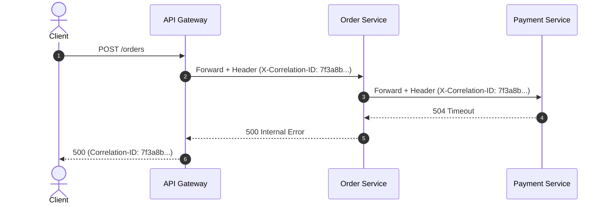

# Structured Logging & Correlation

Logs provide contextual records of discrete execution events. In microservice architectures, unformatted text strings become impossible to search during an active incident.

---

## Structured vs Unstructured Logging

### Bad: Unstructured String Interpolation
```go
// Anti-pattern: String concatenation prevents indexed querying
log.Printf("Failed payment for user %s with error %v at timestamp %d", userID, err, time.Now().Unix())
```

### Good: Structured JSON Logs
```json
{
  "timestamp": "2026-10-01T21:30:00.124Z",
  "level": "ERROR",
  "service": "checkout-service",
  "trace_id": "4bf92f3577b34da6a3ce929d0e0e4736",
  "span_id": "00f067aa0ba902b7",
  "user_id": "usr_991823",
  "action": "process_payment",
  "error": "gateway_timeout",
  "retry_count": 2,
  "elapsed_ms": 1250
}
```

---

## Correlation IDs

A Correlation ID (or W3C `trace_id`) is generated at the system entry point (e.g., API Gateway) and passed down the call chain via HTTP headers (`X-Correlation-ID` or `traceparent`):



When an engineer searches logs in a central aggregator (Loki, Elasticsearch) using `correlation_id = "7f3a8b..."`, all corresponding log lines across the Gateway, Order Service, and Payment Service appear chronologically in a single view.

---

## Logging Reliability Hazards

1. **Log Volume Explosion**: Adding verbose debug logging under high traffic saturates disk I/O, exhausts network bandwidth to collectors, and can crash the application via thread blocking.
2. **Synchronous Disk Writes**: Synchronous I/O in the request path adds latency. Use asynchronous, buffered, non-blocking log writers with bounded memory buffers.
3. **Sensitive Data Leakage**: Never log credentials, API tokens, full credit card numbers, or personally identifiable information (PII).
