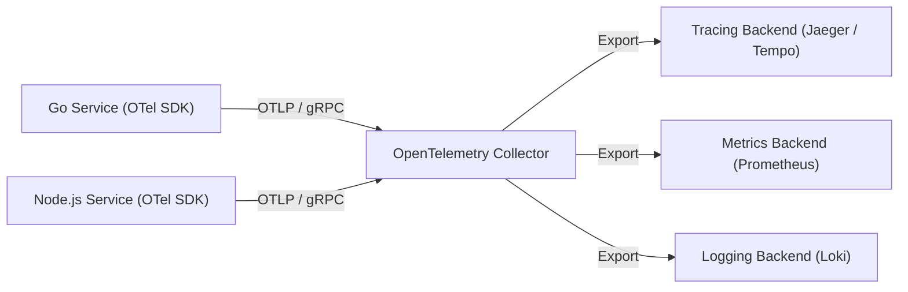

# OpenTelemetry (OTel)

OpenTelemetry is an open-source observability framework providing vendor-neutral APIs, SDKs, and tooling to generate, collect, and export telemetry data (traces, metrics, logs).

---

## Architecture Overview



---

## Core Components

1. **OTel API**: Language-specific interfaces used in application code to create tracers, record spans, and set attributes. Has zero runtime dependencies.
2. **OTel SDK**: The concrete implementation that manages span batching, memory buffering, sampling algorithms, and network exporters.
3. **OpenTelemetry Collector**: A standalone proxy that receives telemetry via OTLP (OpenTelemetry Protocol), applies transformations and filtering, and fans out data to downstream storage backends.

---

## Instrumenting a Go HTTP Service

```go
package main

import (
	"context"
	"net/http"

	"go.opentelemetry.io/otel"
	"go.opentelemetry.io/otel/attribute"
	"go.opentelemetry.io/otel/trace"
)

var tracer = otel.Tracer("checkout-service")

func handleOrder(w http.ResponseWriter, r *http.Request) {
	ctx, span := tracer.Start(r.Context(), "ProcessOrder",
		trace.WithAttributes(attribute.String("http.method", r.Method)))
	defer span.End()

	// Perform database query with child span
	queryDatabase(ctx)

	w.WriteHeader(http.StatusOK)
}

func queryDatabase(ctx context.Context) {
	_, span := tracer.Start(ctx, "QueryInventoryDB")
	defer span.End()
	// database interaction logic...
}
```

---

## Tradeoffs and Overhead

- **CPU Overhead**: In high-throughput services, serializing span contexts and emitting gRPC packets introduces 1-3% CPU overhead.
- **Collector Memory**: When using tail-based sampling, the collector must buffer spans until completion. High concurrency requires tuning collector memory limits to avoid OOM crashes.
