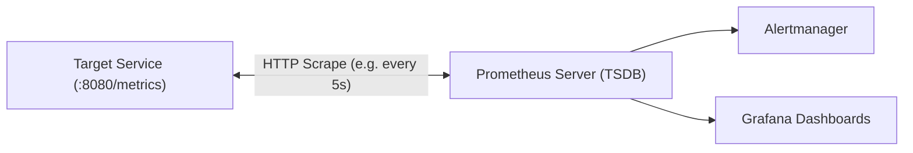

# Prometheus: Telemetry, Metric Types & PromQL

Prometheus is a time-series database optimized for high-throughput metric collection via an HTTP pull model.



---

## The Four Core Metric Types

### 1. Counter
A cumulative metric that represents a single monotonically increasing value. It can only increase or reset to zero on restart.
- **Use for**: Total requests served, total errors encountered, bytes sent.
- **Raw Counter Rule**: Never query a raw counter directly (`http_requests_total`). Always calculate per-second rate of change using `rate()`.
```go
var httpRequestsTotal = promauto.NewCounterVec(
    prometheus.CounterOpts{
        Name: "http_requests_total",
        Help: "Total number of HTTP requests processed.",
    },
    []string{"method", "path", "status"},
)
```

### 2. Gauge
A metric that represents a single numerical value that can arbitrarily go up or down.
- **Use for**: Current memory usage, active concurrent connections, queue depth, CPU utilization percentage.
```go
var activeConnections = promauto.NewGauge(
    prometheus.GaugeOpts{
        Name: "active_connections_current",
        Help: "Current number of open TCP connections.",
    },
)
```

### 3. Histogram
Samples observations (typically request durations or response sizes) and counts them in configurable bucket intervals. Also exposes a `_sum` and `_count`.
- **Use for**: Latency and response size distributions. Enables mathematically valid percentile aggregations across multiple cluster instances using `histogram_quantile()`.
```go
var requestDuration = promauto.NewHistogramVec(
    prometheus.HistogramOpts{
        Name:    "http_request_duration_seconds",
        Help:    "HTTP request latency distributions in seconds.",
        Buckets: []float64{0.005, 0.01, 0.025, 0.05, 0.1, 0.25, 0.5, 1, 2.5, 5},
    },
    []string{"path", "status"},
)
```

### 4. Summary
Calculates streaming configurable quantiles (e.g., $\phi=0.95, 0.99$) client-side.
- **Limitation**: Quantiles calculated on individual application instances **cannot be aggregated or averaged** across a cluster. For distributed cloud-native services, prefer **Histograms**.

---

## Cardinality: The Prometheus Memory Hazard

The cardinality of a metric is the total number of unique label combinations:
$$\text{Cardinality} = \prod (\text{Count of unique values for label } i)$$

- **Safe labels**: `method` (GET, POST, PUT), `status_code` (200, 404, 500), `region` (us-east, eu-west). Cardinality remains low and bounded.
- **Hazardous labels**: `user_id`, `email`, `order_id`, `ip_address`, `timestamp`.
  - Adding `user_id` with 500,000 active users multiplies each metric into 500,000 unique time-series chunks in memory, leading to out-of-memory crashes (`OOMKilled`) in Prometheus.

---

## Essential PromQL Reference

### 1. `rate()` vs `increase()`
- `rate(v[range])`: Calculates the per-second average rate of increase of a counter over the specified time window, accounting for counter resets.
```promql
# Request rate (req/sec) over a 2-minute rolling window
sum(rate(http_requests_total{status=~"2.."}[2m])) by (path)
```
- `increase(v[range])`: Calculates total counter growth over the time window.
```promql
# Total error count over the last 1 hour
sum(increase(http_requests_total{status=~"5.."}[1h]))
```

### 2. `histogram_quantile()`
Computes the $\phi$-quantile ($0 \le \phi \le 1$) from the buckets of a histogram.
```promql
# 99th percentile latency across all pods in seconds
histogram_quantile(0.99, sum(rate(http_request_duration_seconds_bucket[5m])) by (le))
```
> [!IMPORTANT]
> Always aggregate with `sum(...) by (le)` before passing into `histogram_quantile`. Omitting `le` or using `avg` produces invalid mathematical results.

### 3. `predict_linear()`
Predicts the future value of a gauge using linear regression based on past trends.
```promql
# Alert if disk space will exhaust within 4 hours based on the last 1 hour trend
predict_linear(node_filesystem_free_bytes[1h], 4 * 3600) < 0
```

---

## Alerting Basics

Prometheus rules evaluate PromQL expressions at regular intervals (`evaluation_interval`). If an expression evaluates to true for longer than `for`, the alert transitions from `Pending` to `Firing`.

Example from [`alerts.yml`](file:///observability/prometheus/alerts.yml):
```yaml
groups:
  - name: reliability_alerts
    rules:
      - alert: HighErrorRate
        expr: |
          sum(rate(http_requests_total{status=~"5.."}[2m]))
          /
          sum(rate(http_requests_total[2m])) > 0.05
        for: 1m
        labels:
          severity: critical
        annotations:
          summary: "Error rate exceeds 5% on {{ $labels.instance }}"
```
