# Distributed Tracing

Distributed tracing provides end-to-end visibility into requests moving across service boundaries. While metrics indicate that latency is high, traces reveal which specific hop or dependency caused the delay.

---

## Core Components of a Trace

```mermaid
gantt
    title Distributed Request Trace (Trace ID: a1b2c3d4)
    dateFormat X
    axisFormat %s ms
    section API Gateway
    HTTP POST /checkout : 0, 500
    section Auth Service
    Validate JWT : 10, 60
    section Order Service
    Create Order Record : 70, 480
    section Payment Gateway
    Stripe API Call (Remote) : 100, 450
```



- **Trace**: A directed acyclic graph (DAG) representing the complete journey of a request. Identified by a unique 128-bit `trace_id`.
- **Span**: A named, timed operation representing a single contiguous piece of work (e.g., executing an HTTP call or database query).
- **Context Propagation**: The mechanism of transmitting `trace_id`, `parent_span_id`, and sampling flags across process boundaries via standard wire protocols (e.g., W3C Trace Context headers).

---

## Context Propagation: W3C Trace Context

The standardized HTTP header used for context propagation is `traceparent`:
```text
traceparent: 00-4bf92f3577b34da6a3ce929d0e0e4736-00f067aa0ba902b7-01
              │  └─────────────┬────────────────┘ └───────┬──────┘ └┬┘
           Version          Trace ID                  Parent Span ID Flags
```

- `00`: Protocol version.
- `Trace ID`: Unique 16-byte identifier shared across all services handling this transaction.
- `Parent Span ID`: 8-byte identifier of the immediate caller's span.
- `Flags`: Bitmask; `01` indicates the trace was sampled for recording.

---

## Sampling Strategies

Collecting 100% of traces at 50,000 req/sec generates massive network and storage overhead. Production tracing relies on sampling:

1. **Head-Based Sampling**: The root service makes a sampling decision at request start (e.g., sample 1% of requests).
   - *Limitation*: May discard rare 500 errors if the decision was made before the error occurred.
2. **Tail-Based Sampling**: The collector buffers spans until the trace completes, then applies rules (e.g., sample 100% of traces that had status $\ge 500$ or took $> 1000\text{ms}$, but only 0.1% of healthy fast requests).
