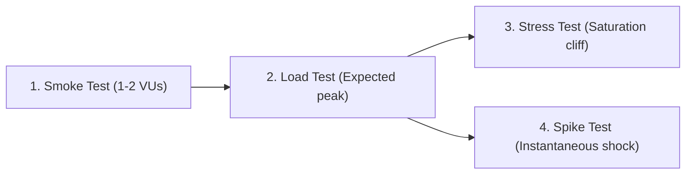

# Performance & Load Testing

Performance testing is finding the boundary where a system transitions from stable operation to degraded latency, resource saturation, and failure.

---

## The Testing Spectrum

| Test Type | Objective | Duration | Target Load | Key Question |
|---|---|---|---|---|
| **Smoke** | Sanity check | 30s | Minimal (2 VUs) | *Did the deployment break basic endpoints?* |
| **Load** | Validate SLO compliance | 1-2 min | Expected Peak (20 VUs) | *Can the system meet p95 latency targets under steady traffic?* |
| **Stress** | Discover breaking point | 3 min | Beyond Peak (50-300 VUs) | *Where is the saturation cliff and how does latency degrade?* |
| **Spike** | Measure recovery after shock | 1 min | $5 \to 200 \to 5$ VUs | *Do queues clear, or does it trigger death spirals?* |

---

## Why Arithmetic Averages Hide Outages

Never evaluate performance using average (mean) latency.

### The Math of Hidden Misery
Imagine a service processing 100 requests:
- 98 requests complete in $10\text{ms}$.
- 2 requests stall for $10,000\text{ms}$ (10 seconds) due to connection timeout.

$$\text{Average Latency} = \frac{(98 \times 10) + (2 \times 10000)}{100} = \frac{980 + 20000}{100} = 209.8\text{ms}$$

An automated report showing "Average: 210ms" appears healthy. However, **$2\%$ of all customers experienced a catastrophic 10-second stall**.  
- $p50 = 10\text{ms}$
- $p95 = 10\text{ms}$
- $p99 = 10,000\text{ms}$

Percentiles ($p95, p99$) immediately expose tail latency cliffs.

---

## Executable Test Suite

All executable scripts and configurations reside in:
- [k6 Testing Suite](k6/README.md)
  - [smoke.js](k6/smoke.js)
  - [load.js](k6/load.js)
  - [stress.js](k6/stress.js)
  - [spike.js](k6/spike.js)
