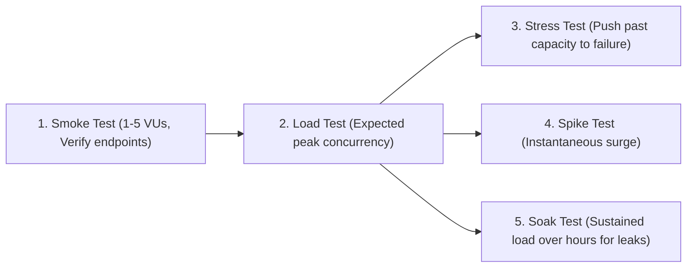
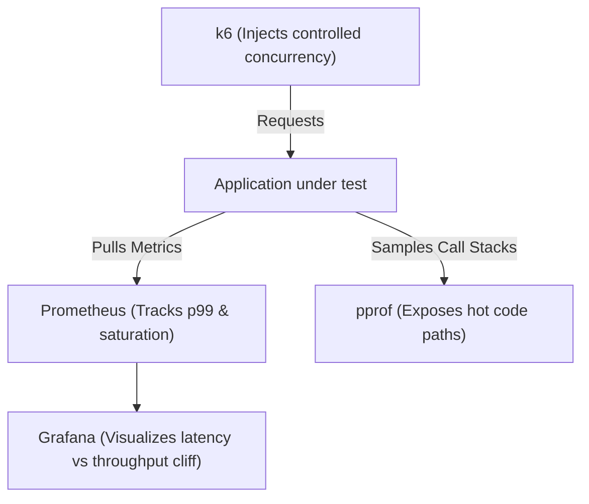

# Performance & Load Testing with k6

Performance testing is not merely verifying that an application functions under minimal load; it is finding the precise boundary where a system transitions from stable operation to degraded latency, resource saturation, and failure.

---

## The Testing Spectrum

| Test Type | Objective | Duration | Target Load | Key Question |
|---|---|---|---|---|
| **Smoke** | Sanity check | 1-2 min | Minimal (1-5 VUs) | *Did the deployment break basic endpoints?* |
| **Load** | Validate SLA compliance | 10-30 min | Expected Peak | *Can the system meet p99 latency targets at peak traffic?* |
| **Stress** | Discover breaking point | 15-45 min | Beyond Peak (1.5x - 3x) | *Where is the saturation cliff and how does it degrade?* |
| **Spike** | Measure recovery after shock | 5-10 min | $0 \to 10\times \to 0$ | *Do queues clear, or does it trigger death spirals?* |
| **Soak** | Expose leaks and drift | 4-24 hours | 70% Max Capacity | *Do memory leaks, connection leaks, or disk growth appear?* |

---

## Why Arithmetic Averages Hide Outages

Never evaluate performance using average (mean) latency.

### The Math of Hidden Misery
Imagine a service processing 100 requests:
- 98 requests complete in $10\text{ms}$.
- 2 requests stall for $10,000\text{ms}$ (10 seconds) due to connection timeout.

$$\text{Average Latency} = \frac{(98 \times 10) + (2 \times 10000)}{100} = \frac{980 + 20000}{100} = 209.8\text{ms}$$

An automated report showing "Average: 210ms" appears healthy. However, **$2\%$ of all customers experienced a catastrophic 10-second stall**.  
- $p50 = 10\text{ms}$
- $p95 = 10\text{ms}$
- $p99 = 10,000\text{ms}$

Percentiles ($p95, p99, p99.9$) immediately expose tail latency cliffs.

---

## Closed-Loop Workflow: Testing + Metrics + Profiling

---

## Directory Index

- [`smoke-testing/`](file:///performance-testing/smoke-testing/README.md) – Sanity verification scripts.
- [`load-testing/`](file:///performance-testing/load-testing/README.md) – Expected peak verification scripts.
- [`stress-testing/`](file:///performance-testing/stress-testing/README.md) – Ramping to failure boundary.
- [`spike-testing/`](file:///performance-testing/spike-testing/README.md) – Instantaneous traffic burst scripts.
- [`soak-testing/`](file:///performance-testing/soak-testing/README.md) – Extended endurance testing.
- [`k6/`](file:///performance-testing/k6/README.md) – Reusable k6 test scripts with Prometheus thresholds.
