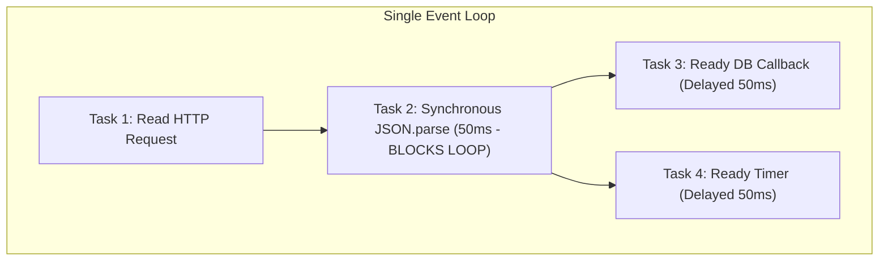

# Async-Aware Profiling: Node.js & Python

In single-threaded asynchronous runtimes (Node.js event loop, Python `asyncio`), traditional thread-based profilers fail because all asynchronous tasks share the same underlying OS thread or event loop.

---

## The Async Problem

In synchronous multithreaded systems, each slow request blocks its dedicated thread. In an asynchronous event loop:
- One CPU-intensive synchronous task blocks **all** concurrent requests on that event loop.
- Conversely, an application handling 10,000 concurrent requests waiting on database responses may report 2% CPU usage while request latencies skyrocket to 10 seconds due to task queue backlog delays.



---

## Example: Event Loop Delay in Node.js

```typescript
import http from 'http';

const server = http.createServer((req, res) => {
  if (req.url === '/block') {
    // Synchronous regex or CPU loop that blocks the entire Node.js event loop
    const start = Date.now();
    while (Date.now() - start < 2000) {
      // 2 seconds CPU spin
    }
    res.end('Blocked complete');
  } else if (req.url === '/fast') {
    // Fast lightweight endpoint
    res.end('Fast response');
  }
});

server.listen(3000);
```

### Observation:
When `/block` is called:
- Even though `/fast` requires 0.1ms of work, any incoming `/fast` requests are queued behind the synchronous block and take $> 2000\text{ms}$.
- Standard metrics show CPU spiked to 100% on one core.

---

## Diagnostic Tools for Async Runtimes

1. **Event Loop Lag Monitoring**:
   - Node.js: `perf_hooks.monitorEventLoopDelay({ resolution: 20 })`
   - Exposes `min`, `max`, `p99` event loop delay. When event loop delay $> 50\text{ms}$, the server is experiencing event loop starvation.
2. **Clinic.js (Doctor / Bubbleprof)**:
   - Tracks promise chains, async hooks, and identifies whether bottlenecks are I/O latency or event loop blocking.
3. **Python `asyncio` Debug Mode**:
   - `asyncio.run(main(), debug=True)`
   - Emits warnings whenever a coroutine blocks the event loop for longer than `slow_callback_duration` (default: 100ms).
