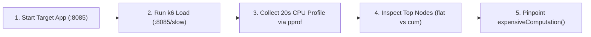

# Go CPU Profiling with `pprof`

This lab demonstrates how to use Go's built-in `net/http/pprof` sampler to locate and diagnose CPU bottlenecks under load.

---

## Lab Architecture

The target application ([app/main.go](app/main.go)) exposes two HTTP endpoints:
- `/fast`: Performs an $O(1)$ fast in-memory response.
- `/slow`: Invokes `expensiveComputation()`, which performs a deliberate quadratic $O(n^2)$ bubble sort on 2,500 integers.
- `/debug/pprof/`: Built-in Go diagnostic sampling endpoints.

---

## Step-by-Step Lab Workflow



### Step 1: Start the Target Application
In terminal 1:
```bash
cd profiling/cpu
go run app/main.go
```
The server will listen on `http://localhost:8085`.

### Step 2: Generate Traffic with k6
In terminal 2, start generating load:
```bash
cd profiling/cpu
k6 run load.js
```
`load.js` directs 80% of requests to `/slow` to keep CPU execution active during profiling.

### Step 3: Capture and Inspect Profile (CLI)
While k6 is running, capture a 20-second CPU profile in terminal 3:
```bash
go tool pprof http://localhost:8085/debug/pprof/profile?seconds=20
```

Inside the interactive `pprof` CLI, run:
```text
(pprof) top 10
```

#### Understanding `flat` vs `cum`
- **`flat`**: Time spent strictly inside that function's instructions (excluding downstream functions it calls). `expensiveComputation` will show high flat time because of the nested sorting loop.
- **`cum` (cumulative)**: Total time spent in that function **plus all callees**. `slowHandler` will show high cumulative time because it calls `expensiveComputation`.

To view line-by-line source annotations:
```text
(pprof) list expensiveComputation
```
`pprof` will print the exact source lines of `expensiveComputation` with cycle counts beside the nested `for` loop.

### Step 4: Visual Analysis & Flame Graph (Web UI)
To inspect the profile visually in your browser:
```bash
go tool pprof -http=:8081 http://localhost:8085/debug/pprof/profile?seconds=20
```
Open `http://localhost:8081` in your browser. From the top navigation menu, select:
- **Top**: Tabular flat vs cum view.
- **Graph**: Directed call graph with edge weights.
- **Flame Graph**: Interactive flame graph highlighting hot call stacks.

---

## Cleanup
Stop the Go process with `Ctrl+C`. Clean up any saved profile files:
```bash
make clean
```
