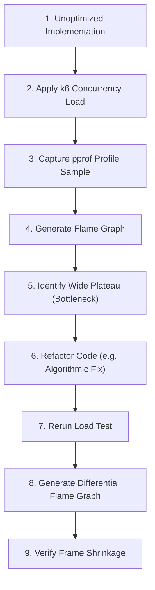

# Flame Graphs: Visualizing Call Stacks

Invented by Brendan Gregg, **Flame Graphs** are hierarchical visualizations of profile sample distributions, converting thousands of lines of call stack text into an intuitive visual landscape.

---

## Anatomy of a Flame Graph

```text
  ┌───────────────────────────────────────────────────────────────┐
  │                   runtime.mallocgc (28%)                      │  <-- Top of stack
  ├───────────────────────────────────────────────────────────────┤
  │             main.allocateBufferSlow (30%)                     │
  ├───────────────────────────────────────────────────────────────┤
  │                    main.handleRequest (85%)                   │  <-- Hot path
  ├───────────────────────────────────────────────────────────────┤
  │                      net/http.Handler (98%)                   │  <-- Bottom of stack
  └───────────────────────────────────────────────────────────────┘
```

### The Three Fundamental Rules
1. **Vertical Axis (Y-Axis) = Stack Depth**: The top-most box represents the function currently executing when the sample was taken. Boxes below it represent callers (ancestor frames).
2. **Horizontal Axis (X-Axis) = Sample Frequency / Time**: The width of a box is proportional to the fraction of total samples in which that function (or its children) appeared. **The X-axis is alphabetical, NOT chronological.**
3. **Colors Are Arbitrary**: Colors are randomized by default to differentiate frames. In differential flame graphs, red indicates growth and blue indicates shrinkage.

---

## Interpreting Wide Frames

- **A Wide "Plateau" at the Top**: A function whose box is wide and has no children above it has high **self (flat) CPU time**. It is spending time in its own loops or arithmetic.
- **A Wide "Tower" Narrowing Rapidly**: A deep call stack that quickly narrows indicates deep recursion or boilerplate abstraction with little actual time spent at each level.
- **Widespread Thin Spikes**: Many small, separate frames distributed across the width indicate distributed overhead (e.g., thousands of tiny memory allocations or runtime scheduling checks).

---

## What Flame Graphs Can and Cannot Support

### Flame Graphs CAN Prove:
- Which specific functions were on-CPU or allocating heap during the sample window.
- The exact call pathways that invoked a bottleneck function.
- Relative improvements before and after an algorithmic optimization.

### Flame Graphs CANNOT Prove:
- **I/O Latency**: An on-CPU flame graph will never show slow database queries or network wait times because sleeping threads are not sampled.
- **Order of Execution**: Because the horizontal axis is sorted alphabetically to aggregate identical stack frames, you cannot determine which function ran first.
- **Causality of Spikes**: A single flame graph captures an aggregate average over a time window; it cannot explain why a specific individual request took 2 seconds.

---

## Optimization Feedback Loop


*(Demonstrated end-to-end in [`experiments/cpu-bottleneck/`](file:///experiments/cpu-bottleneck/README.md))*.
