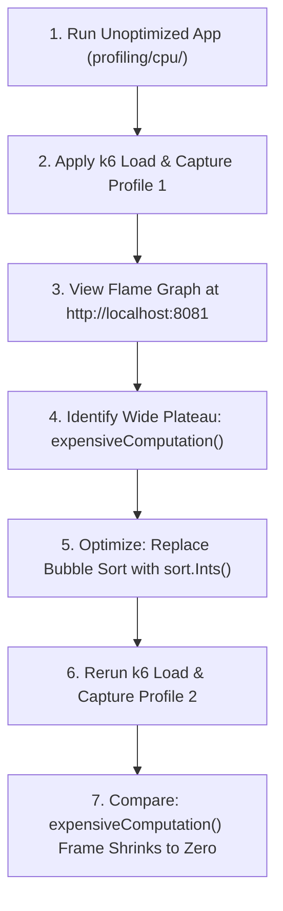

# Understanding & Using Flame Graphs

A **Flame Graph** (invented by Brendan Gregg) is a hierarchical visualization of sampled stack traces, converting thousands of profiling records into an intuitive visual graph.

This lab builds directly on the CPU profiling experiment in [`profiling/cpu/`](../cpu/README.md).

---

## The Four Visual Rules

```text
  ┌───────────────────────────────────────────────────────────────┐
  │                   runtime.mallocgc (28%)                      │  <-- Top of stack
  ├───────────────────────────────────────────────────────────────┤
  │             main.expensiveComputation (82%)                   │  <-- Wide plateau (Bottleneck)
  ├───────────────────────────────────────────────────────────────┤
  │                    main.slowHandler (85%)                     │  <-- Ancestor frame
  ├───────────────────────────────────────────────────────────────┤
  │                      net/http.(*conn).serve (98%)             │  <-- Root caller
  └───────────────────────────────────────────────────────────────┘
```

1. **Horizontal Axis ($X$-Axis) = Sample Frequency / Time**: The width of a box is proportional to the fraction of total samples in which that function (or its callees) appeared. **The $X$-axis is alphabetical, NOT chronological.**
2. **Vertical Axis ($Y$-Axis) = Call Stack Depth**: The top-most box represents the function executing at the moment of the sample. Boxes below it represent callers (ancestor frames).
3. **Colors Are Arbitrary**: Default color palettes (reds, yellows, oranges) are randomized warm tones to distinguish adjacent frames; color does **not** indicate CPU intensity or severity.
4. **Flame Graphs show *where* time was spent, not *why* code is slow**: A wide frame proves a function consumed CPU cycles; it cannot tell you if the root cause was an unindexed loop, inefficient memory layout, or bad business logic.

---

## The Diagnostics & Optimization Loop



---

## Step-by-Step Exercise

### Step 1: Collect Baseline Profile
Run the CPU profiling target and capture a 20-second profile under load:
```bash
# Terminal 1: Start app
cd profiling/cpu && go run app/main.go

# Terminal 2: Run load
cd profiling/cpu && k6 run load.js

# Terminal 3: Capture profile
curl -s http://localhost:8085/debug/pprof/profile?seconds=20 > profile_unoptimized.pb.gz
```

### Step 2: Open Flame Graph in Browser
Go's built-in `pprof` tool includes a native web-based flame graph renderer (no external Perl scripts or graphviz required):
```bash
go tool pprof -http=:8081 profile_unoptimized.pb.gz
```
- Navigate to `http://localhost:8081/ui/flamegraph`.
- Locate the wide plateau for `main.expensiveComputation`: it spans the vast majority of the width.

### Step 3: Optimize the Implementation
In `profiling/cpu/app/main.go`, replace the $O(n^2)$ bubble sort in `expensiveComputation`:

```go
// Optimized implementation: Replace O(n^2) with standard O(n log n)
func expensiveComputation(n int) int {
    data := make([]int, n)
    for i := 0; i < n; i++ {
        data[i] = rand.Intn(10000)
    }
    // Standard library introsort / pdqsort
    sort.Ints(data)
    return data[0]
}
```

### Step 4: Capture Optimized Profile & Compare
Restart the application with the optimized code, run `load.js` again, and capture a second profile:
```bash
curl -s http://localhost:8085/debug/pprof/profile?seconds=20 > profile_optimized.pb.gz
```

Now compare the two profiles directly using `pprof -base`:
```bash
go tool pprof -http=:8082 -base profile_unoptimized.pb.gz profile_optimized.pb.gz
```
- Navigate to `http://localhost:8082/ui/flamegraph`.
- In differential mode, `expensiveComputation` appears in bright blue/negative frames, demonstrating that its share of CPU time has been eliminated.
