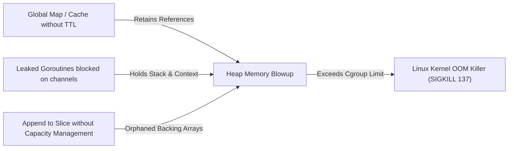

# Memory Profiling & Leaks

Memory profiling analyzes how an application allocates, retains, and releases RAM. Uncontrolled memory usage degrades reliability via garbage collection pauses, container throttling, and eventual `OOMKilled` (Exit code 137).

---

## Memory Terminology

- **Allocated Memory (`alloc_space`)**: The cumulative total volume of memory allocated by the program since process startup, including objects already garbage-collected.
- **In-Use Memory (`inuse_space`)**: The actual volume of memory currently allocated and reachable on the heap right now.
- **Retained Memory**: Memory that cannot be freed by GC because root references (global maps, open goroutines, event listeners) are still pointing to it.
- **Resident Set Size (RSS)**: Total physical memory currently mapped to the process by the OS kernel, including heap, stack, and loaded libraries.

---

## The Four Memory Profiles in Go

When querying `http://localhost:8080/debug/pprof/heap`:

1. `-inuse_space`: Bytes of allocated heap currently alive. (Best for finding active memory leaks).
2. `-inuse_objects`: Number of live objects. (Best for finding metadata leaks with millions of tiny structs).
3. `-alloc_space`: Total bytes allocated since startup. (Best for identifying functions that trigger frequent GC cycles).
4. `-alloc_objects`: Total number of objects allocated since startup.

---

## Common Memory Leak Patterns



---

## Diagnosing a Leak with `pprof`

Capture two snapshots 5 minutes apart during a load test:

```bash
# Capture baseline
curl -s http://localhost:8080/debug/pprof/heap > heap_base.pb.gz

# Wait 5 minutes under load...
curl -s http://localhost:8080/debug/pprof/heap > heap_load.pb.gz

# Compare differential growth
go tool pprof -base heap_base.pb.gz heap_load.pb.gz
```

Inside the CLI, running `top` shows only the net bytes leaked between the two captures:
```text
(pprof) top
Showing nodes accounting for 120MB, 100% of 120MB total
      flat  flat%   sum%        cum   cum%
     120MB   100%   100%      120MB   100%  main.trackUnboundedCache
```
